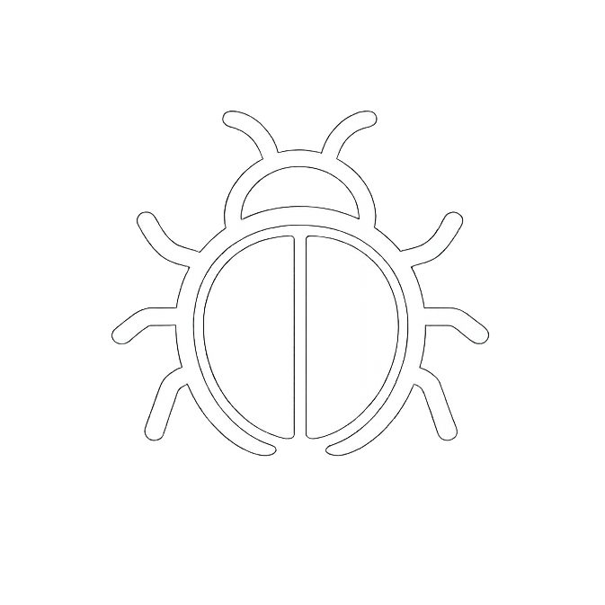

#  FB - Clean My Feeds

      

[English](README.md) | **Tiếng Việt**

Bạn đáng ra phải là người quyết định mình thấy gì trên mạng, nhưng Facebook cứ liên tục ném đủ thứ rác vào mặt bạn, đến mức gần như không thể theo dõi nổi bạn bè và những trang bạn thật sự quan tâm. "FB - Clean My Feeds" là chiếc xô lau nhà bạn kéo vào mỗi khi muốn giành lại quyền kiểm soát.

Đây là một userscript cho Tampermonkey hoặc Violentmonkey giúp chặn quảng cáo Facebook, ẩn bài viết gợi ý và dọn bảng tin Facebook cho gọn gàng hơn.

Ban đầu được tạo bởi **[zbluebugz](https://github.com/zbluebugz)** và đã được thử lửa ngoài thực tế từ năm 2021.

Xin cảm ơn **[trinhquocviet](https://github.com/trinhquocviet)** vì đã hỗ trợ duy trì bộ lọc trong năm 2025.

##  Cài đặt

1. Cài một trình quản lý userscript như **[Violentmonkey](https://violentmonkey.github.io/)**, **[Tampermonkey](https://www.tampermonkey.net/)** hoặc **[FireMonkey](https://addons.mozilla.org/en-US/firefox/addon/firemonkey/)**.
2. Thêm script theo cách bạn thích:
   - Từ repo này: mở [`fb-clean-my-feeds.user.js`](https://raw.githubusercontent.com/Artificial-Sweetener/facebook-clean-my-feeds/main/fb-clean-my-feeds.user.js) rồi để trình quản lý userscript của bạn nhập vào.
   - Hoặc truy cập [trang phát hành trên GreasyFork](https://greasyfork.org/en/scripts/552339-fb-clean-my-feeds-5-05) và bấm **install this script**.
3. Tải lại Facebook. Bạn có thể để biểu tượng cây lau nhà xuất hiện ở góc dưới bên trái, góc trên bên phải, hoặc ẩn hẳn đi.

##  Tính năng

"FB - Clean My Feeds" được tạo ra để giúp trải nghiệm lướt Facebook của bạn gọn hơn, yên hơn, và hoàn toàn nằm trong tay bạn.

- **Quét sạch quảng cáo:** Tự động chặn quảng cáo Facebook, dọn các bài "Sponsored", nhãn "Paid Partnership" và các mục "Suggested for you" trên News, Groups, Watch, Marketplace, Search và Reels.
- **Hoạt động tốt bất kể Facebook dùng ngôn ngữ nào:** Các bộ lọc cốt lõi được thiết kế để chạy ổn trên nhiều ngôn ngữ của Facebook mà không phụ thuộc vào từ điển dịch, nên chúng vẫn làm tốt phần việc của mình ngay cả khi Facebook của bạn không dùng tiếng Anh.
- **Dẹp bớt AI cho đỡ mệt:** Ẩn thẻ "Try Meta AI", các gợi ý prompt của Meta AI, và mấy thứ gây xao nhãng ở panel bên cạnh trước khi chúng chiếm luôn feed của bạn.
- **Thu gọn bố cục:** Ẩn Reels, "Short Videos", và cả những dãy "Stories" to đùng chiếm hết màn hình. Bạn còn có thể tắt nguyên những khu như Marketplace nếu chẳng bao giờ dùng tới.
- **Lọc bớt ồn ào:** Tạo danh sách chặn theo từ hoặc cụm từ cụ thể (có hỗ trợ regex!). Bạn cũng có thể đặt ngưỡng số "Like" để bớt thấy những bài quá viral và giữ feed mang tính cá nhân hơn.
- **Dọn bảng tin Facebook cho đỡ phiền đầu:** Script sẽ loại bớt "People You May Know", gợi ý "Follow", khảo sát quảng bá, và các chiêu câu tương tác khác. Ngoài ra bạn còn có thể tạm dừng GIF và video tự phát để khỏi bị motion đập thẳng vào mắt.
- **Điều khiển dễ dàng:** Một menu cài đặt gọn gàng, đẹp mắt và hỗ trợ nhiều ngôn ngữ. Chỉ cần bấm biểu tượng cây lau nhà, bật những gì bạn muốn, và thấy kết quả ngay.

##  Cách dùng Bảng Điều Khiển

- Bấm biểu tượng cây lau nhà **Clean My Feeds** (hoặc mở từ menu của trình quản lý userscript) để mở hộp thoại cài đặt.
- Các tùy chọn được nhóm theo từng feed (News, Groups, Watch, Marketplace, Profiles, Search, Reels). Bật những gì bạn muốn, lưu lại, và script sẽ quét lại trang ngay lập tức.
- Bật **Debug** nếu muốn hiện các bài bị ẩn bằng viền chấm để bạn dễ kiểm tra thứ gì đang bị lọc.
- Dùng **Export / Import** để sao lưu cài đặt. Script lưu tùy chọn cục bộ; khi duyệt web ẩn danh/private, các thiết lập đó sẽ mất khi phiên kết thúc.

### Hỗ trợ ngôn ngữ

Bảng điều khiển có nhiều bản địa hóa giao diện để phần cài đặt, nhãn và lý do ẩn bài vẫn rõ ràng ngay cả khi Facebook của bạn đang dùng ngôn ngữ khác.

  
Ngôn ngữ được hỗ trợ

- English
- Português (Portugal & Brazil)
- Deutsch
- Français
- Español
- Čeština
- Tiếng Việt
- Italiano
- Latviešu
- Polski
- Nederlands
- עברית
- العربية
- Bahasa Indonesia
- 中文（简体）
- 中文（繁體）
- 日本語
- Suomi
- Türkçe
- Ελληνικά
- Русский
- Українська
- Български

Nếu bạn thấy chỗ nào dịch chưa ổn hoặc còn thiếu, cứ mở issue. Mình rất muốn phần giao diện này ngày càng mượt và dễ hiểu hơn cho người dùng không dùng tiếng Anh.

##  Đóng góp & Hỗ trợ

- **Issues & Features:** Cứ mở issue nếu có gì hỏng hoặc Facebook lại đổi markup thêm lần nữa. Mình có đọc.
- **Pull Requests:** Rất hoan nghênh. Giữ phạm vi gọn và mô tả rõ bạn đã sửa gì.
- **Translations:** Nếu bạn muốn giúp phần chữ trên giao diện sắc sảo hơn ở nhiều ngôn ngữ, mình rất sẵn lòng.

##  Giấy phép & Ghi công

- **License:** GNU General Public License v3.0. Bạn được quyền chia sẻ, chỉnh sửa và cải tiến, miễn là vẫn giữ lại những quyền tự do đó cho người khác.
- **Original Project:** [facebook-clean-my-feeds](https://github.com/zbluebugz/facebook-clean-my-feeds) bởi [zbluebugz](https://github.com/zbluebugz)
- **Hỗ trợ duy trì bộ lọc (2025):** [trinhquocviet](https://github.com/trinhquocviet)
- **Current Maintainer:** [Artificial Sweetener](https://github.com/Artificial-Sweetener) - chính là mình!~

##  Từ người duy trì

Mình hy vọng script này sẽ giúp bạn lấy lại feed của mình. Mình hứa sẽ đứng về phía bạn trong cuộc chiến chống lại những thứ bạn chẳng muốn phải thấy trên mạng.

- **Website & mạng xã hội của mình**: Bạn có thể xem tranh, thơ và những cập nhật dev khác của mình tại [artificialsweetener.ai](https://artificialsweetener.ai).
- **Nếu bạn thích dự án này**, mình sẽ rất trân trọng nếu bạn ghé cho nó một ngôi sao trên GitHub!! ⭐
